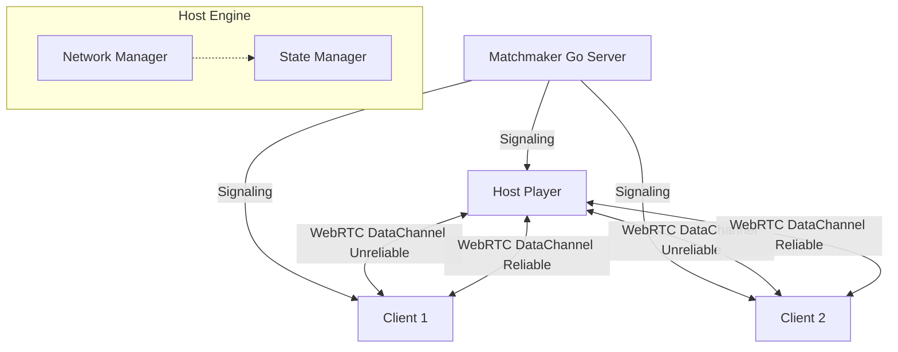

<!--
// Copyright (c) 2024-2026 Soumya Debnath. All Rights Reserved.
// Licensed under the Business Source License 1.1 (BSL 1.1).
// See LICENSE file for details. Production use requires a paid license.
// Contact: soumyadebnath1661@gmail.com | +91 7031648617
-->

# SyncPlay

[](https://mariadb.com/bsl11/)
[](#known-limitations)

> **Host-Authoritative P2P Multiplayer Engine for the Browser**

SyncPlay is a lightweight, real-time multiplayer networking engine designed for the web. It uses a **Host-Authority model**, WebRTC for peer-to-peer data channels, and JSON Patch (RFC 6902) for efficient state deltas. Build multiplayer games entirely in the browser without deploying expensive dedicated game servers.

## Table of Contents
1. [What Problem it Solves](#what-problem-it-solves)
2. [Architecture](#architecture)
3. [API Reference](#api-reference)
4. [Multiplayer Game Examples](#multiplayer-game-examples)
5. [How it Works Internally](#how-it-works-internally)
6. [Comparison with Competitors](#comparison-with-competitors)
7. [State Interpolation](#state-interpolation)
8. [Deployment Guide](#deployment-guide)
9. [Configuration Options](#configuration-options)
10. [Known Limitations](#known-limitations)
11. [FAQ](#faq)
12. [Author & License](#author--license)

## What Problem it Solves

Traditional multiplayer games use dedicated game servers (like AWS GameLift). This requires heavy backend infrastructure, scaling logic, and a high server bill. While great for MMORPGs or competitive e-sports, this is often overkill for casual multiplayer web games, co-op experiences, and rapid prototyping.

**SyncPlay solves this by using a Host-Authority Model:**
- **Zero Game Servers**: One of the players in the lobby acts as the "Host" (the server).
- **WebRTC Data Channels**: Clients connect directly to the Host peer-to-peer for the lowest possible latency. UDP-like unreliable channels are used for fast-paced movement, while reliable channels handle critical game state.
- **Cheap Matchmaking**: The only backend required is a lightweight Matchmaker (provided in Go) that helps players exchange WebRTC SDP offers and ICE candidates.
- **Delta Sync**: State changes are computed automatically and transmitted using tiny JSON Patch arrays, minimizing bandwidth.

**Cost Comparison (1000 Concurrent Players):**
- Dedicated Servers (Photon / PlayFab): ~$50 - $200+ / month
- **SyncPlay**: ~$5 / month (only need a tiny VPS for the Matchmaker/Signaling)

## Architecture



1. **Matchmaker (Signaling Server)**: Exists solely to group players into rooms and facilitate the WebRTC handshake.
2. **Host**: The room creator. Holds the authoritative `StateManager`. Sends state patches down to clients, validates client inputs.
3. **Clients**: Connect to the host. They send inputs (e.g., "move left") to the host and receive authoritative state updates. They apply `Interpolator` logic to smooth out movement between network ticks.

---

## WebRTC Dual DataChannels

- **Unreliable Movement Channel (`ordered: false, maxRetransmits: 0`)**: Low-latency transport for high-frequency player coordinates, velocity vectors, and camera angles where dropped frames are acceptable.
- **Reliable Event Channel (`ordered: true`)**: Ordered delivery for critical state changes, RPC events, player inventory mutations, and lobby state updates.

---

## API Reference

### `SyncPlay`
The core engine class.

#### `constructor(matchmakerUrl: string, options?: SyncPlayOptions)`
- `matchmakerUrl`: URL to the signaling server (e.g., `wss://signaling.example.com`).
- `options`: `{ tickRate: 20, maxPlayers: 8 }`

#### `createRoom(roomId?: string): Promise<Room>`
Creates a new room. The calling player becomes the Host (`_isHost = true`).

#### `joinRoom(roomId: string): Promise<Room>`
Joins an existing room. The calling player becomes a Client.

#### `setState(path: string, value: any): void`
*Host Only.* Updates the game state at a specific JSON path and automatically broadcasts a patch to all clients.
Example: `syncplay.setState('/players/123/x', 50)`

#### `getState(path?: string): any`
Returns the local copy of the game state.

#### Properties
- `playerId: string` (Your unique ID)
- `isHost: boolean` (Are you the authoritative host?)
- `playerCount: number`

### `StateManager`
Handles the JSON Patch logic.
- `applyPatch(patch: StatePatch)`: Applies a patch to the local state tree.
- `on('state_changed', callback)`: Fired when state updates.

### `Interpolator`
Provides utilities for client-side prediction and smoothing.
- `Interpolator.lerp(start, end, t)`
- `interpolatePosition(current, target, t)`

## Multiplayer Game Examples

### Basic 2D Movement
```typescript
import { SyncPlay, Interpolator } from 'https://cdn.jsdelivr.net/gh/itsoumya-d/syncplay@main/dist/index.mjs';

const engine = new SyncPlay('wss://match.mygame.com');

// Create or Join
if (window.location.hash) {
  await engine.joinRoom(window.location.hash.slice(1));
} else {
  const room = await engine.createRoom();
  window.location.hash = room.id;
}

// Host Logic
if (engine.isHost) {
  engine.setState('/players', {});
  
  engine.on('player_join', (id) => {
     engine.setState(`/players/${id}`, { x: 0, y: 0 });
  });

  engine.on('client_input', (id, input) => {
      const current = engine.getState(`/players/${id}`);
      if (input.key === 'ArrowUp') current.y -= 5;
      engine.setState(`/players/${id}`, current);
  });
}

// Client Logic
let localX = 0, localY = 0;
setInterval(() => {
   engine.sendInput({ key: 'ArrowUp' });
   
   const authState = engine.getState(`/players/${engine.playerId}`);
   if (authState) {
       const newPos = Interpolator.interpolatePosition(
           {x: localX, y: localY}, 
           authState, 
           0.2
       );
       localX = newPos.x;
       localY = newPos.y;
       renderPlayer(localX, localY);
   }
}, 16);
```

## How it Works Internally

1. **State Deltas**: When the host calls `setState('/enemies/5/hp', 90)`, the `StateManager` generates a patch: `[{ "op": "replace", "path": "/enemies/5/hp", "value": 90 }]`. This minimizes bandwidth.
2. **Tick Rate**: State patches are buffered and flushed at the configured `tickRate` (default 20 times per second) via the `NetworkManager`'s reliable channel.
3. **Unreliable Channels**: For volatile data like player rotation or mouse positions where dropped packets are acceptable, SyncPlay exposes `broadcastUnreliable()`.

## Comparison with Competitors

| Feature | SyncPlay | Photon PUN | PlayFab | Socket.io |
|---------|----------|------------|---------|-----------|
| **Architecture** | P2P Host Authority | Dedicated/Relay | Dedicated | Client-Server |
| **Transport** | WebRTC Data (UDP/TCP) | UDP (Reliable/Unreliable) | TCP/UDP | TCP (WebSocket) |
| **State Sync** | Built-in (JSON Patch) | Manual / RPC | Manual | Manual |
| **Browser Support**| Native | Requires Plugin/WASM | Requires HTTP | Native |
| **Cost** | Extremely Low | High | High | Medium |

## State Interpolation

Because networks are inherently laggy, sending updates 20 times a second will look jittery if rendered at 60 FPS. SyncPlay includes an `Interpolator` utility.

Instead of snapping entities directly to their `getState()` position, you interpolate from their current visual position towards their authoritative position over time. This hides network latency and packet loss.

## Deployment Guide

### Matchmaker (Signaling Server)
The provided Matchmaker is written in Go and uses standard WebSockets.

1. **Build via Docker:**
   ```bash
   cd matchmaker
   docker build -t syncplay-matchmaker .
   ```

2. **Run it:**
   ```bash
   docker run -p 8080:8080 syncplay-matchmaker
   ```

3. **Production Reverse Proxy (Nginx):**
   ```nginx
   server {
       listen 443 ssl;
       server_name match.yourgame.com;
       
       location /ws {
           proxy_pass http://localhost:8080/ws;
           proxy_set_header Upgrade $http_upgrade;
           proxy_set_header Connection "Upgrade";
       }
   }
   ```

## Configuration Options

```typescript
export interface SyncPlayOptions {
  maxPlayers?: number;       // Default: 8
  tickRate?: number;         // Server tick rate in Hz. Default: 20
  iceServers?: RTCIceServer[]; // STUN/TURN config
  autoReconnect?: boolean;   // Default: true
}
```

---

## Known Limitations

- **Pre-release software.** API may change. No production adopters are known yet.
- **Not published on npm.** The package name `syncplay` is not registered. Use jsDelivr CDN or build from source:
  ```
  https://cdn.jsdelivr.net/gh/itsoumya-d/syncplay@main/dist/index.mjs
  ```
- **No TURN relay — connections fail behind symmetric or carrier-grade NAT.** The ICE configuration uses public STUN servers only (Google and Cloudflare). STUN cannot traverse symmetric NAT (common on corporate networks) or many mobile carrier-grade NAT deployments; those peers cannot connect at all. There is currently no relay fallback. The failure is also **not clearly surfaced** — when `connectionState` becomes `'failed'` or `'disconnected'`, the code calls `handlePeerLeft()`, which emits the same `'peer-left'` event as a voluntary disconnect. Callers cannot distinguish "unreachable network" from "peer left the game". If you need reliable connectivity across arbitrary networks, pass your own TURN server in `iceServers`.
- **Host migration is not implemented.** Despite what earlier documentation implied, there is no automatic host migration. When the host disconnects, the room closes. The FAQ entry about "future versions" supporting host migration is aspirational only.
- **Single-host cheating.** The host player controls the authoritative state tree and can modify it arbitrarily. This is acceptable for co-op or private lobbies, but unsuitable for competitive games requiring server-side validation.
- **Browser-only.** Node.js is not supported.

---

## FAQ

**Q: Can clients cheat?**
A: Since one client is the Host, they have the technical ability to modify memory and cheat (e.g., give themselves infinite health). For competitive games with matchmaking, you should use dedicated servers. SyncPlay is designed for co-op games, private lobbies, or casual games where host-cheating is acceptable.

**Q: What happens if the Host disconnects?**
A: Currently, the room closes. Host migration is not implemented.

**Q: Does this work on Mobile?**
A: Yes. WebRTC DataChannels are fully supported on iOS Safari and Android Chrome, subject to the NAT limitations described above.

---

## Author & License

**Author:** Soumya Debnath
**Email:** soumyadebnath1661@gmail.com
**Phone:** +91 7031648617

---

## License — Business Source License 1.1

> **Source-available, NOT open-source. All production use requires a paid license.**
> Replaces: Photon, PlayFab, GameLift

| Tier | Price | For |
|:-----|:------|:----|
| **Indie** | $349/year | Solo developer, <$100K revenue |
| **Startup** | $2,499/year | Up to 10-25 devs, <$5M revenue |
| **Enterprise** | $12,999/year | Unlimited seats, unlimited revenue |
| **OEM / White-Label** | $24,999/year | Embed in your product |
| **Full IP Buyout** | $1,000,000 | Complete ownership transfer |

**Free use limited to:** Personal evaluation, academic research, contributing via PRs.

[soumyadebnath1661@gmail.com](mailto:soumyadebnath1661@gmail.com) · [+91 7031648617](tel:+917031648617) · [github.com/itsoumya-d](https://github.com/itsoumya-d)

© 2024-2026 Soumya Debnath. All Rights Reserved.
