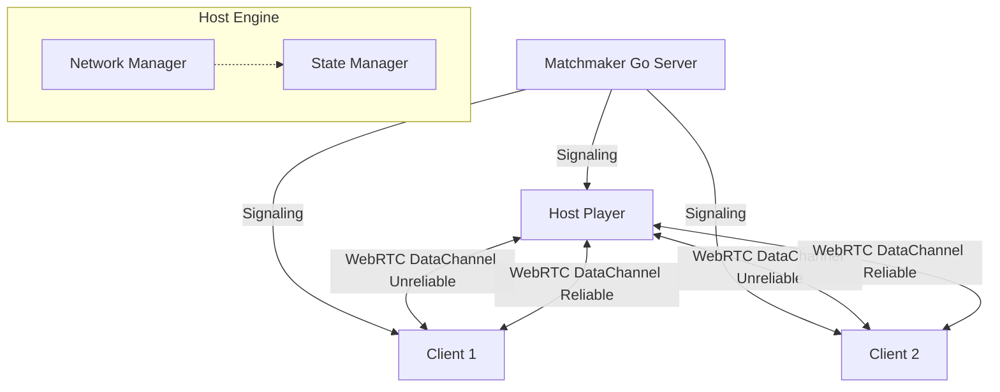

<!--
// Copyright (c) 2024-2026 Soumya Debnath. All Rights Reserved.
// Dual-licensed: AGPL-3.0-or-later (free, see LICENSE) OR a commercial licence
// (see COMMERCIAL_LICENSE.md) if you cannot meet the AGPL's source-disclosure terms.
// Contact: soumyadebnath1661@gmail.com
-->

# SyncPlay

[](https://www.gnu.org/licenses/agpl-3.0)
[](#known-limitations)

> **SyncPlay synchronises multiplayer game state peer-to-peer with host authority, removing the per-concurrent-user cost of a hosted realtime backend.**

SyncPlay is a lightweight, real-time multiplayer networking engine designed for the web. It uses a **Host-Authority model**, WebRTC for peer-to-peer data channels, and JSON Patch (RFC 6902) for efficient state deltas. Build multiplayer games entirely in the browser without deploying expensive dedicated game servers.

## Table of Contents
1. [What Problem it Solves](#what-problem-it-solves)
2. [Architecture](#architecture)
3. [API Reference](#api-reference)
4. [Multiplayer Game Examples](#multiplayer-game-examples)
5. [How it Works Internally](#how-it-works-internally)
6. [Comparison with Competitors](#comparison-with-competitors)
7. [State Interpolation](#state-interpolation)
8. [Deployment Guide](#deployment-guide)
9. [Configuration Options](#configuration-options)
10. [Known Limitations](#known-limitations)
11. [FAQ](#faq)
12. [Author & License](#author--license)

## What Problem it Solves

Traditional multiplayer games use dedicated game servers (like AWS GameLift). This requires heavy backend infrastructure, scaling logic, and a high server bill. While great for MMORPGs or competitive e-sports, this is often overkill for casual multiplayer web games, co-op experiences, and rapid prototyping.

**SyncPlay solves this by using a Host-Authority Model:**
- **Zero Game Servers**: One of the players in the lobby acts as the "Host" (the server).
- **WebRTC Data Channels**: Clients connect directly to the Host peer-to-peer for the lowest possible latency. UDP-like unreliable channels are used for fast-paced movement, while reliable channels handle critical game state.
- **Cheap Matchmaking**: The only backend required is a lightweight Matchmaker (provided in Go) that helps players exchange WebRTC SDP offers and ICE candidates.
- **Delta Sync**: State changes are computed automatically and transmitted using tiny JSON Patch arrays, minimizing bandwidth.

**Cost Comparison (1000 Concurrent Players):** these are list-price estimates for the
compared vendors plus the cost of a small VPS for signalling. They are not benchmark
results, and they exclude the TURN relay bandwidth you will need for peers behind
symmetric NAT.
- Dedicated Servers (Photon / PlayFab): ~$50 - $200+ / month
- **SyncPlay**: ~$5 / month for the signalling VPS, plus TURN egress if you add a relay.
  The software itself is free under AGPL-3.0-or-later.

## Architecture



1. **Matchmaker (Signaling Server)**: Exists solely to group players into rooms and facilitate the WebRTC handshake.
2. **Host**: The room creator. Holds the first `StateManager` and is elected as `hostId`.
   **Note:** the engine does *not* validate inbound patches beyond rejecting malformed
   and unsafe paths. Any peer's patch is applied to your local state tree as-is. See
   [Known Limitations](#known-limitations).
3. **Clients**: Connect over WebRTC and exchange state patches. There is no built-in
   input-command channel; you send your own messages and let the host mutate state via
   `setState()`. `Interpolator` is a pure lerp helper you call from your render loop.

---

## WebRTC Dual DataChannels

- **Unreliable Movement Channel (`ordered: false, maxRetransmits: 0`)**: Low-latency transport for high-frequency player coordinates, velocity vectors, and camera angles where dropped frames are acceptable.
- **Reliable Event Channel (`ordered: true`)**: Ordered delivery for critical state changes, RPC events, player inventory mutations, and lobby state updates.

---

## API Reference

### `SyncPlay`
The core engine class.

#### `constructor(matchmakerUrl: string, options?: SyncPlayOptions)`
- `matchmakerUrl`: URL to the signaling server (e.g., `wss://signaling.example.com`).
  Must be a string — passing an options object as the first argument throws a `TypeError`.
- `options`: see [Configuration Options](#configuration-options).

#### `createRoom(roomId?: string): Promise<Room>`
Creates a new room. The calling player becomes the Host (`_isHost = true`).

#### `joinRoom(roomId: string): Promise<Room>`
Joins an existing room. The calling player becomes a Client.

#### `setState(path: string, value: any): boolean`
Updates local game state at a JSON Pointer path and queues a patch, which is flushed to
all peers on the next tick over the **reliable** channel. Returns `false` (and changes
nothing) when the path is rejected — non-string, empty, traversing a scalar, or containing
`__proto__` / `constructor` / `prototype`.
Example: `syncplay.setState('/players/123/x', 50)`

Any peer may call this; there is no host-only enforcement.

#### `getState(path?: string): any`
Returns the local copy of the game state.

#### Events
Subscribe with `engine.on(event, cb)` and unsubscribe with `engine.off(event, cb)`.

| Event | Payload | Meaning |
|---|---|---|
| `peer-joined` | `peerId` | A peer's reliable channel opened. |
| `peer-left` | `peerId` | A peer disconnected or was torn down. |
| `peer-failed` | `SyncPlayNetworkError` | ICE failed (`ice-failed`) or the handshake timed out (`peer-handshake-timeout`). **Distinct from `peer-left`.** |
| `signaling-closed` | `SyncPlayNetworkError` | The signalling socket closed mid-session. |
| `error` | `SyncPlayNetworkError` | Any other transport-level fault. |
| `state-update` | `StatePatch[]` | Patches received from a peer and applied. |
| `patches-rejected` | `{ peerId, count, patches }` | Inbound patches that failed validation. |
| `patches-dropped` | `{ total, reason }` | The pending-patch buffer overflowed. |
| `peer-rejected` | `{ peerId, reason }` | A peer was refused, e.g. `room-full`. |
| `host-changed` / `host-migrated` | `hostId` | `hostId` was recomputed; `host-migrated` fires only when *you* became host. |
| `tick` | – | One game-loop tick. |

#### Properties
- `playerId: string` (128-bit random hex ID)
- `isHost: boolean` (Are you the authoritative host?)
- `playerCount: number`

### `StateManager`
Handles the JSON Patch logic.
- `applyPatch(patch: StatePatch)`: Applies a patch to the local state tree.
- `on('state_changed', callback)`: Fired when state updates.

### `Interpolator`
A pure, stateless lerp helper for smoothing rendered positions. It does **not** implement
client-side prediction, snapshot buffering, or server reconciliation.
- `Interpolator.lerp(start, end, t)` — `t` is clamped to `[0, 1]`
- `Interpolator.interpolatePosition(current, target, t)` — static; also available on an instance

## Multiplayer Game Examples

### Basic 2D Movement

```typescript
import { SyncPlay, Interpolator } from 'https://cdn.jsdelivr.net/gh/itsoumya-d/syncplay@main/dist/index.mjs';

const engine = new SyncPlay('wss://match.mygame.com', { tickRate: 20, maxPlayers: 8 });

// Always subscribe to failures first — ICE failure is reported separately from
// a player voluntarily leaving.
engine.on('error',       (err) => console.error(err.code, err.message));
engine.on('peer-failed', (err) => console.error('peer unreachable:', err.code, err.peerId));

// Create or join
let room;
if (window.location.hash) {
  room = await engine.joinRoom(window.location.hash.slice(1));
} else {
  room = await engine.createRoom();
  window.location.hash = room.id;
}

// Seed state on whichever peer is currently host
if (engine.isHost) {
  engine.setState('/players', {});
}

// A peer connected: give it a spawn point (host only, by your own convention)
engine.on('peer-joined', (id) => {
  if (engine.isHost) engine.setState(`/players/${id}`, { x: 0, y: 0 });
});

// Apply inbound state from peers
engine.on('state-update', (patches) => {
  // state is already applied; use this to trigger rendering
});

// Send your own movement by writing to your own subtree
document.addEventListener('keydown', (e) => {
  const me = engine.getState(`/players/${engine.playerId}`) ?? { x: 0, y: 0 };
  if (e.key === 'ArrowUp') me.y -= 5;
  engine.setState(`/players/${engine.playerId}`, me);
});

// Render loop: smooth towards the networked position
let localX = 0, localY = 0;
function frame() {
  const target = engine.getState(`/players/${engine.playerId}`);
  if (target) {
    const p = Interpolator.interpolatePosition({ x: localX, y: localY }, target, 0.2);
    localX = p.x; localY = p.y;
    renderPlayer(localX, localY);
  }
  requestAnimationFrame(frame);
}
requestAnimationFrame(frame);
```

> **There is no `sendInput()` method and no `client_input` event.** Earlier revisions of
> this README showed both; neither has ever existed. Peers communicate by writing to the
> shared state tree with `setState()`.

## How it Works Internally

1. **State Deltas**: When the host calls `setState('/enemies/5/hp', 90)`, the `StateManager` generates a patch: `[{ "op": "replace", "path": "/enemies/5/hp", "value": 90 }]`. This minimizes bandwidth.
2. **Tick Rate**: State patches are buffered and flushed at the configured `tickRate`
   (default 20 Hz) over the **reliable, ordered** channel. State deltas are cumulative, so a
   dropped patch would desync peers permanently — they must not travel on a lossy channel.
3. **Unreliable Channels**: For volatile data like rotation or cursor position, where the
   next tick supersedes a dropped packet, use `room`'s NetworkManager `broadcastUnreliable()`.
   Note there is no sequence number or tick index on the wire, so out-of-order delivery on
   this channel cannot be detected or corrected by the engine.

## Comparison with Competitors

| Feature | SyncPlay | Photon PUN | PlayFab | Socket.io |
|---------|----------|------------|---------|-----------|
| **Architecture** | P2P Host Authority | Dedicated/Relay | Dedicated | Client-Server |
| **Transport** | WebRTC Data (UDP/TCP) | UDP (Reliable/Unreliable) | TCP/UDP | TCP (WebSocket) |
| **State Sync** | Built-in (JSON Patch) | Manual / RPC | Manual | Manual |
| **Browser Support**| Native | Requires Plugin/WASM | Requires HTTP | Native |
| **Cost** | Extremely Low | High | High | Medium |

## State Interpolation

Because networks are inherently laggy, sending updates 20 times a second will look jittery if rendered at 60 FPS. SyncPlay includes an `Interpolator` utility.

Instead of snapping entities directly to their `getState()` position, you interpolate from their current visual position towards their authoritative position over time. This hides network latency and packet loss.

## Deployment Guide

### Matchmaker (Signaling Server)

> **The Go server in `matchmaker/` is NOT a working signalling server.** It registers exactly
> one route, `POST /api/rooms`, which mints a room ID. It contains no WebSocket upgrade
> handler (`go.mod` has no `require` block and `go.sum` is empty, so there is no
> `gorilla/websocket` dependency). The client connects to `ws://<host>/ws/<roomId>/<playerId>`,
> which this server answers with `404`. **You must supply your own signalling server.**
>
> It must, at minimum:
> - accept `GET /ws/{roomId}/{playerId}` and upgrade to WebSocket;
> - on join, send `{"type":"peer-joined","peerId":"<other>"}` to each existing member and
>   to the newcomer for each existing member;
> - relay `offer` / `answer` / `ice-candidate` messages, rewriting the sender's `target`
>   field into a `peerId` field on the message delivered to the recipient;
> - on disconnect, send `{"type":"peer-left","peerId":"<gone>"}` to the remaining members.
>
> `POST /api/rooms` must return `{"roomId":"<string>"}`.

The Go code that *is* provided builds and runs, and is useful only as the room-ID endpoint.

1. **Build via Docker:**
   ```bash
   cd matchmaker
   docker build -t syncplay-matchmaker .
   ```

2. **Run it:**
   ```bash
   docker run -p 8080:8080 syncplay-matchmaker
   ```

3. **Production Reverse Proxy (Nginx):**
   ```nginx
   server {
       listen 443 ssl;
       server_name match.yourgame.com;

       location /ws {
           proxy_pass http://localhost:8080/ws;
           proxy_http_version 1.1;
           proxy_set_header Upgrade $http_upgrade;
           proxy_set_header Connection "Upgrade";
           proxy_read_timeout 3600s;
       }

       # Required as well — the previous snippet omitted this, so createRoom() 404'd.
       location /api/ {
           proxy_pass http://localhost:8080/api/;
       }
   }
   ```
   `proxy_http_version 1.1` is mandatory; without it nginx speaks HTTP/1.0 upstream and the
   WebSocket upgrade fails.

## Configuration Options

```typescript
export interface SyncPlayOptions {
  maxPlayers?: number;              // Default: unlimited
  tickRate?: number;                // Patch-flush frequency in Hz. Default: 20
  iceServers?: RTCIceServer[];      // Default: public STUN only (no TURN)
  signalingTimeoutMs?: number;      // Default: 15000
  peerHandshakeTimeoutMs?: number;  // Default: 20000
  matchmakerTimeoutMs?: number;     // Default: 10000
  autoStartGameLoop?: boolean;      // Default: true
  licenseKey?: string;              // Or COMMERCIAL_LICENSE_KEY env var
  allowEval?: boolean;
}
```

There is **no** `autoReconnect` option. Nothing in the engine reconnects: if the signalling
socket closes you get a `signaling-closed` event and must call `joinRoom()` again yourself.

---

## Known Limitations

- **Pre-release software.** API may change. No production adopters are known yet.
- **Not published on npm.** The package name `syncplay` is not registered. Use jsDelivr CDN or build from source:
  ```
  https://cdn.jsdelivr.net/gh/itsoumya-d/syncplay@main/dist/index.mjs
  ```
- **No TURN relay by default — connections fail behind symmetric or carrier-grade NAT.**
  The default ICE configuration is public STUN only (Google and Cloudflare). STUN cannot
  traverse symmetric NAT (common on corporate networks) or many mobile carrier-grade NAT
  deployments; those peers cannot connect at all. Pass your own TURN server via
  `iceServers` if you need connectivity across arbitrary networks. ICE failure is now
  reported on the **`peer-failed`** event with `code: 'ice-failed'`, separately from
  `peer-left`, so you can tell the two apart.
- **No signalling server is included.** See [Deployment Guide](#deployment-guide).
- **No reconnection.** There is no retry, backoff, or reconnect logic anywhere. When the
  signalling socket drops you get `signaling-closed` and must re-join yourself.
- **No authority enforcement, and "host authority" is advisory only.** `hostId` is elected
  as the lexicographically smallest player ID and is used for nothing except the
  `isHost` getter. Every peer applies every other peer's patches to its own state tree
  with no ownership, range, or rate checks. `_playerId` is a public writable field, so a
  peer can also assign itself a low ID and win the host election. Suitable for co-op and
  private lobbies only — **not** for anything competitive or ranked.
- **No prediction, rollback, or lockstep.** State patches carry no tick index, sequence
  number, sender ID, or timestamp. The engine is last-write-wins state replication, not
  a rollback/GGPO-style netcode. `Interpolator` is a lerp helper, not a prediction system.
- **Partial JSON Patch.** Only `add`, `replace` and `remove` are implemented. `move`,
  `copy` and `test` are rejected with a `patches-rejected` event. RFC 6901 `~0`/`~1`
  pointer escaping is supported; array index and `-` append semantics are not.
- **Host migration is only partial.** `hostId` is recomputed when the peer list changes and
  `host-changed` / `host-migrated` fire, but **no state is transferred and the new host is
  never announced to the other peers over the wire.** Do not rely on it.
- **Browser-only.** Node.js is not supported (no `RTCPeerConnection`).

---

## FAQ

**Q: Can clients cheat?**
A: Yes, trivially, and not only the host. Every peer applies every other peer's patches
without validation, and nothing stops a peer from claiming to be the host. Use SyncPlay for
co-op, private lobbies, or casual games only. For anything competitive, run a dedicated
authoritative server.

**Q: What happens if the Host disconnects?**
A: The remaining peers each recompute `hostId` locally (lowest player ID wins) and fire
`host-changed`. No game state is transferred and the decision is not confirmed over the
wire, so treat this as a hint, not a working host-migration feature.

**Q: Does this work on Mobile?**
A: Yes. WebRTC DataChannels are fully supported on iOS Safari and Android Chrome, subject to the NAT limitations described above.

---

## 📄 License

**Dual-licensed — choose either:**

1. **[AGPL-3.0-or-later](LICENSE)** — free for any purpose, including commercial and production
   use. No payment, no permission, no key required. The obligation it carries: if you modify this
   software and let users interact with it over a network, you must offer those users your modified
   source under the same licence.

2. **[Commercial licence](COMMERCIAL_LICENSE.md)** — for organisations that cannot or prefer not to
   meet the AGPL's source-disclosure obligation. This buys an exception, not access.

Contributions are accepted under AGPL-3.0-or-later. Full terms: [LICENSING.md](LICENSING.md).

## ⚖️ Commercial licence (optional)

> **This software is free under [AGPL-3.0-or-later](LICENSE) — including for commercial and
> production use.** The prices below buy one specific thing: an exception to the AGPL's requirement
> that you publish your modifications if you run a modified version as a network service.
> Replaces: Photon, PlayFab, GameLift

| Tier | Price | For |
|:-----|:------|:----|
| **Indie** | $349/year | Solo developer, <$100K revenue |
| **Startup** | $2,499/year | Up to 10-25 devs, <$5M revenue |
| **Enterprise** | $12,999/year | Unlimited seats, unlimited revenue |
| **OEM / White-Label** | $24,999/year | Embed in your product |
| **Full IP Buyout** | $1,000,000 | Complete ownership transfer |

**Free under AGPL-3.0-or-later:** any use, including production and commercial, provided you meet the AGPL's terms.

[soumyadebnath1661@gmail.com](mailto:soumyadebnath1661@gmail.com) · [github.com/itsoumya-d](https://github.com/itsoumya-d)

© 2024-2026 Soumya Debnath. All Rights Reserved.
