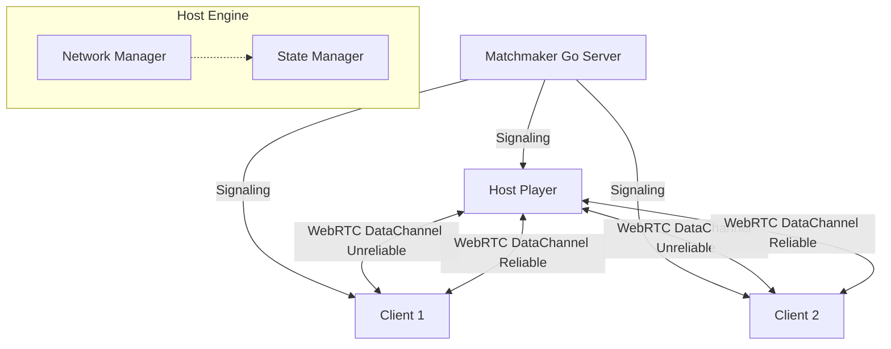

# SyncPlay


](https://mariadb.com/bsl11/)

> **Lightning Fast Host-Authoritative Multiplayer Engine**

SyncPlay is a lightweight, high-performance real-time multiplayer networking engine designed for the web. It uses a **Host-Authority model**, WebRTC for peer-to-peer data channels, and JSON Patch (RFC 6902) for ultra-efficient state deltas. Build fast-paced multiplayer games entirely in the browser without deploying expensive dedicated game servers!

## Table of Contents
1. [What Problem it Solves](#what-problem-it-solves)
2. [Architecture](#architecture)
3. [API Reference](#api-reference)
4. [Multiplayer Game Examples](#multiplayer-game-examples)
5. [How it Works Internally](#how-it-works-internally)
6. [Comparison with Competitors](#comparison-with-competitors)
7. [State Interpolation](#state-interpolation)
8. [Deployment Guide](#deployment-guide)
9. [Configuration Options](#configuration-options)
10. [FAQ](#faq)
11. [Author & License](#author--license)

## What Problem it Solves

Traditional multiplayer games use dedicated game servers (like AWS GameLift). This requires heavy backend infrastructure, scaling logic, and a high server bill. While great for MMORPGs or competitive e-sports, this is often overkill for casual multiplayer web games, co-op experiences, and rapid prototyping.

**SyncPlay solves this by using a Host-Authority Model:**
- **Zero Game Servers**: One of the players in the lobby acts as the "Host" (the server).
- **WebRTC Data Channels**: Clients connect directly to the Host peer-to-peer for the lowest possible latency. UDP-like unreliable channels are used for fast-paced movement, while reliable channels handle critical game state.
- **Cheap Matchmaking**: The only backend required is a lightweight Matchmaker (provided in Go) that helps players exchange WebRTC SDP offers and ICE candidates.
- **Delta Sync**: State changes are computed automatically and transmitted using tiny JSON Patch arrays, minimizing bandwidth.

**Cost Comparison (1000 Concurrent Players):**
- Dedicated Servers (Photon / PlayFab): ~$50 - $200+ / month
- **SyncPlay: $5 / month** (Only need a tiny VPS for the Matchmaker/Signaling)

## Architecture



1. **Matchmaker (Signaling Server)**: Exists solely to group players into rooms and facilitate the WebRTC handshake.
2. **Host**: The room creator. Holds the authoritative `StateManager`. Sends state patches down to clients, validates client inputs.
3. **Clients**: Connect to the host. They send inputs (e.g., "move left") to the host and receive authoritative state updates. They apply `Interpolator` logic to smooth out movement between network ticks.

## API Reference

### `SyncPlay`
The core engine class.

#### `constructor(matchmakerUrl: string, options?: SyncPlayOptions)`
- `matchmakerUrl`: URL to the signaling server (e.g., `wss://signaling.example.com`).
- `options`: `{ tickRate: 20, maxPlayers: 8 }`

#### `createRoom(roomId?: string): Promise<Room>`
Creates a new room. The calling player becomes the Host (`_isHost = true`).

#### `joinRoom(roomId: string): Promise<Room>`
Joins an existing room. The calling player becomes a Client.

#### `setState(path: string, value: any): void`
*Host Only.* Updates the game state at a specific JSON path and automatically broadcasts a patch to all clients.
Example: `syncplay.setState('/players/123/x', 50)`

#### `getState(path?: string): any`
Returns the local copy of the game state.

#### Properties
- `playerId: string` (Your unique ID)
- `isHost: boolean` (Are you the authoritative host?)
- `playerCount: number`

### `StateManager`
Handles the JSON Patch logic.
- `applyPatch(patch: StatePatch)`: Applies a patch to the local state tree.
- `on('state_changed', callback)`: Fired when state updates.

### `Interpolator`
Provides utilities for client-side prediction and smoothing.
- `Interpolator.lerp(start, end, t)`
- `interpolatePosition(current, target, t)`

## Multiplayer Game Examples

### 1. Basic 2D Movement
```typescript
import { SyncPlay, Interpolator } from 'syncplay';

const engine = new SyncPlay('wss://match.mygame.com');

// Create or Join
if (window.location.hash) {
  await engine.joinRoom(window.location.hash.slice(1));
} else {
  const room = await engine.createRoom();
  window.location.hash = room.id;
}

// Host Logic
if (engine.isHost) {
  engine.setState('/players', {});
  
  engine.on('player_join', (id) => {
     engine.setState(`/players/${id}`, { x: 0, y: 0 });
  });

  // Listen for client inputs
  engine.on('client_input', (id, input) => {
      const current = engine.getState(`/players/${id}`);
      if (input.key === 'ArrowUp') current.y -= 5;
      engine.setState(`/players/${id}`, current); // Broadcasts delta
  });
}

// Client Logic
let localX = 0, localY = 0;
setInterval(() => {
   // Send input to host
   engine.sendInput({ key: 'ArrowUp' });
   
   // Interpolate visual position towards authoritative state
   const authState = engine.getState(`/players/${engine.playerId}`);
   if (authState) {
       const newPos = Interpolator.interpolatePosition(
           {x: localX, y: localY}, 
           authState, 
           0.2 // Smoothing factor
       );
       localX = newPos.x;
       localY = newPos.y;
       renderPlayer(localX, localY);
   }
}, 16);
```

## How it Works Internally

1. **State Deltas**: When the host calls `setState('/enemies/5/hp', 90)`, the `StateManager` doesn't send the entire enemy object. It generates a patch: `[{ "op": "replace", "path": "/enemies/5/hp", "value": 90 }]`. This is heavily optimized for bandwidth.
2. **Tick Rate**: State patches are not sent instantly. They are buffered and flushed at the configured `tickRate` (default 20 times per second) via the `NetworkManager`'s reliable channel.
3. **Unreliable Channels**: For volatile data like player rotation or mouse positions where dropped packets don't matter, SyncPlay exposes `broadcastUnreliable()`.

## Comparison with Competitors

| Feature | SyncPlay | Photon PUN | PlayFab | Socket.io |
|---------|----------|------------|---------|-----------|
| **Architecture** | P2P Host Authority | Dedicated/Relay | Dedicated | Client-Server |
| **Transport** | WebRTC Data (UDP/TCP) | UDP (Reliable/Unreliable) | TCP/UDP | TCP (WebSocket) |
| **State Sync** | Built-in (JSON Patch) | Manual / RPC | Manual | Manual |
| **Browser Support**| 100% Native | Requires Plugin/WASM | Requires HTTP | 100% Native |
| **Cost** | Extremely Low | High | High | Medium |

## State Interpolation

Because networks are inherently laggy, sending updates 20 times a second will look jittery if rendered at 60 FPS. SyncPlay includes an `Interpolator` utility.

Instead of snapping entities directly to their `getState()` position, you interpolate from their current visual position towards their authoritative position over time. This hides network latency and packet loss.

## Deployment Guide

### Matchmaker (Signaling Server)
The provided Matchmaker is written in Go and uses standard WebSockets.

1. **Build via Docker:**
   ```bash
   cd matchmaker
   docker build -t syncplay-matchmaker .
   ```

2. **Run it:**
   ```bash
   docker run -p 8080:8080 syncplay-matchmaker
   ```

3. **Production Reverse Proxy (Nginx):**
   ```nginx
   server {
       listen 443 ssl;
       server_name match.yourgame.com;
       
       location /ws {
           proxy_pass http://localhost:8080/ws;
           proxy_set_header Upgrade $http_upgrade;
           proxy_set_header Connection "Upgrade";
       }
   }
   ```

### STUN / TURN Servers
WebRTC requires STUN servers to bypass NAT. SyncPlay defaults to Google's public STUN servers. However, for strict enterprise firewalls or symmetric NATs, you will need a TURN server (like Coturn).

You can configure this in `SyncPlayOptions`:
```typescript
const engine = new SyncPlay('wss://match.com', {
  iceServers: [
    { urls: 'stun:stun.l.google.com:19302' },
    { 
      urls: 'turn:turn.mygame.com:3478', 
      username: 'user', 
      credential: 'password' 
    }
  ]
});
```

## Configuration Options

```typescript
export interface SyncPlayOptions {
  maxPlayers?: number;       // Default: 8
  tickRate?: number;         // Server tick rate in Hz. Default: 20
  iceServers?: RTCIceServer[]; // STUN/TURN config
  autoReconnect?: boolean;   // Default: true
}
```

## FAQ

**Q: Can clients cheat?**
A: Since one client is the Host, they have the technical ability to modify memory and cheat (e.g., give themselves infinite health). For competitive games with matchmaking, you should use dedicated servers. SyncPlay is designed for co-op games, private lobbies, or casual games where host-cheating is acceptable.

**Q: What happens if the Host disconnects?**
A: Currently, the room closes. Future versions of SyncPlay will support "Host Migration," automatically electing a new host and transferring the State tree.

**Q: Does this work on Mobile?**
A: Yes! WebRTC DataChannels are fully supported on iOS Safari and Android Chrome.

## Author & License

**Author:** Soumya Debnath  
**Email:** soumyadebnath1661@gmail.com  
**Phone:** +91 7031648617  

SyncPlay is dual-licensed under AGPL-3.0 (open source) and a Commercial License. Commercial support and custom integration services are available upon request.

---

## ⚖️ License — Business Source License 1.1 (BSL 1.1)

> **This is NOT open-source software. Source code is available for viewing, but ALL production use requires a paid license.**

This project uses the **[Business Source License 1.1](https://mariadb.com/bsl11/)** — the same license trusted by HashiCorp (Terraform), Sentry, CockroachDB, and MariaDB.

### What You CAN Do (Free)
- ✅ View, read, and study the source code
- ✅ Run for personal, non-commercial evaluation and testing
- ✅ Use for academic research and education
- ✅ Contribute improvements via pull requests

### What REQUIRES a Paid License
- 💰 Any production deployment
- 💰 Internal business tools
- 💰 SaaS / PaaS / API products
- 💰 Customer-facing applications
- 💰 Integration into any commercial product
- 💰 Any use within an organization with >1 employee

### ⚠️ Anti-Circumvention Protection
- 🔒 This license **CANNOT be removed** from forked or cloned copies
- 🔒 ALL derivative works inherit this license automatically
- 🔒 Removing copyright headers violates copyright law
- 🔒 Every source file contains embedded copyright notices

### 💼 Commercial License Pricing

| Tier | Price | For |
|:-----|:------|:----|
| **Indie** | $499/year | Solo developer, <$100K revenue |
| **Startup** | $2,999/year | Up to 25 employees, <$5M revenue |
| **Enterprise** | $14,999/year | Unlimited seats, unlimited revenue |
| **OEM / White-Label** | Custom pricing | Embedding in your product |
| **Full IP Buyout** | $500K+ | Complete intellectual property transfer |

### 📬 Contact for Licensing

**Soumya Debnath** — Creator & Sole Rights Holder

- 📧 Email: [soumyadebnath1661@gmail.com](mailto:soumyadebnath1661@gmail.com)
- 📞 Phone / WhatsApp: [+91 7031648617](tel:+917031648617)
- 🐙 GitHub: [github.com/itsoumya-d](https://github.com/itsoumya-d)

---
© 2024-2026 Soumya Debnath. All Rights Reserved.

